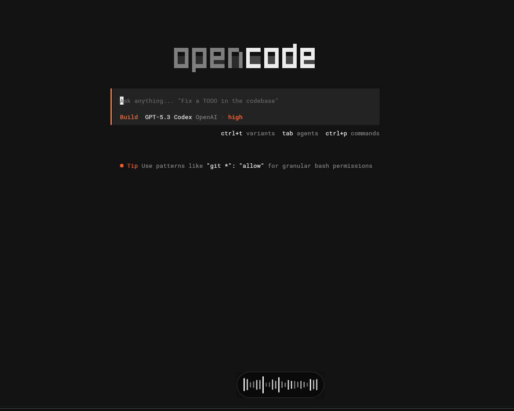

# whisper-dict

`whisper-dict` is a Zig-based system-wide dictation daemon.

The goal is to let you **hold a configured key**, speak, and on release:

1. record audio from your microphone,
2. run `whisper-cli` to transcribe speech to text,
3. inject the transcription into the currently focused app as if typed on a keyboard.



## Usage

Run with default model:

`whisper-dict`

Run with a custom model:

`whisper-dict --model models/ggml-base.en.bin`

Run with a custom output directory:

`whisper-dict --recordings-dir recordings`

Run with automatic language detection:

`whisper-dict --language auto`

Run with a fixed language (example: Czech):

`whisper-dict --language cs`

Note: models ending in `.en` are English-only. For Czech or other languages,
use a multilingual model (for example `large-v3-turbo`, `medium`, `small`, `base`).

Default model path is `models/ggml-large-v3-turbo.bin`.
Default recordings directory is `recordings`.
Default language is `auto`.

For text injection, install at least one backend:

- `wtype` (Wayland)
- `xdotool` (X11)

For the recording overlay indicator, install:

- `eww`

## Linux permissions

For `whisper-dict` to run as a regular user (without root), the user running
the daemon needs:

- Read access to `/dev/input/event*` (required for global Right Ctrl capture).
- Write access to the recordings directory (default: `recordings`, or the path
  set by `--recordings-dir` / `WHISPER_DICT_RECORDINGS_DIR`).
- Microphone access through your audio stack (used by `arecord` or `ffmpeg`).

Most distros gate `/dev/input/event*` behind the `input` group. A common setup
is:

`sudo usermod -aG input $USER`

Then log out and log back in so new group membership takes effect.

## Home Manager module

The flake exports a Home Manager module at `homeManagerModules.whisper-dict`
(also aliased as `homeManagerModules.default`).

Example:

```nix
{
  imports = [ inputs.whisper-dict.homeManagerModules.whisper-dict ];

  services.whisper-dict = {
    enable = true;
    model = "large-v3-turbo";
    language = "auto";
    modelsDir = "${config.xdg.cacheHome}/whisper-dict/models";
    recordingsDir = "/tmp/whisper-dict-recordings";
  };
}
```

When enabled, it creates `systemd --user` service `whisper-dict` that:

- runs `whisper-dict` in the background,
- downloads the configured model with `whisper-cpp-download-ggml-model`
  before start (if missing),
- stores models in `services.whisper-dict.modelsDir`,
- sets transcription language with `services.whisper-dict.language`
  (default `"auto"`),
- stores audio/transcription outputs in
  `services.whisper-dict.recordingsDir` (default: `/tmp/whisper-dict-recordings`).
